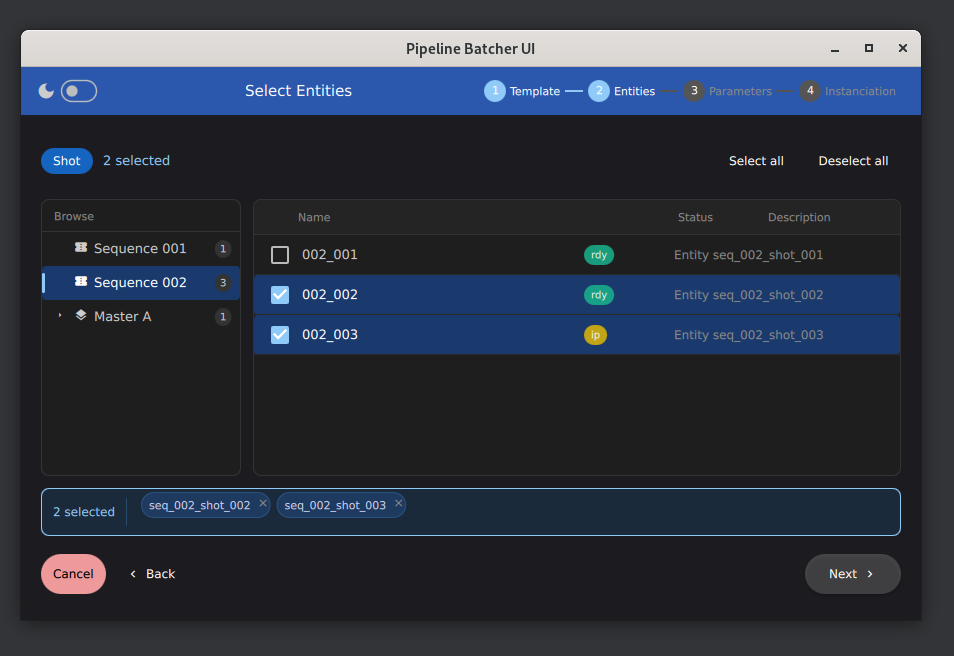
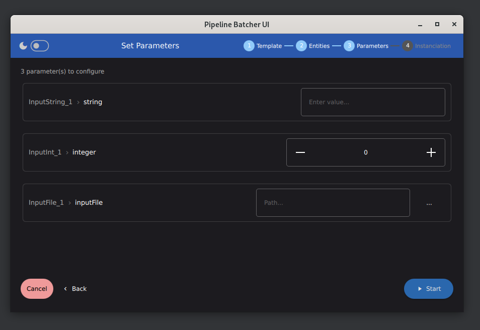

  
  <h1 style="font-size: value;">Meshroom Batcher</h1>
  <i>Pipeline Batcher for Meshroom</i>
   
   

This package contains components that implement a Batcher UI for Meshroom.
The goal is to provide a UI inside Meshroom where users can create and launch a batch of scenes from different source entities.

## How does it work

When the tool is launched, it uses entity providers to fetch info. Each provider must implement method to provide:
- a list of templates
- an entity tree
- entities for a tree group

Then the UI launches.

    
     
    <em>Template Selection UI : select the template to use.</em>

    
     
    <em>Entity Selection UI : select entities to batch.</em>

    
     
    <em>Parameters UI : set values for exposed attributes.</em>

## How to implement a new Entity Provider

