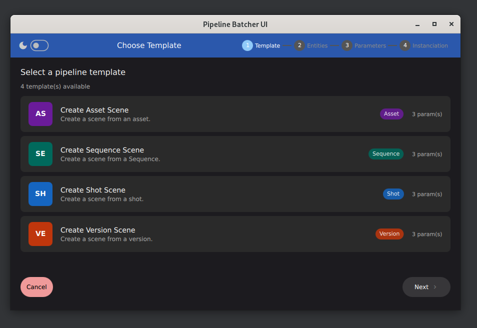

<div align="center">
  
  <h1 style="font-size: value;">
    Meshroom Batcher <br/>
    <a href="https://deepwiki.com/meshroomHub/meshroomBatcher"></a>
  </h1>
  <i>Pipeline Batcher for Meshroom</i>
  <br/>
  <br/>
</div>

This package contains components that implement a Batcher UI for Meshroom.
The goal is to provide a UI inside Meshroom where users can create and launch a batch of scenes from different source entities.

## How to setup

- You need Meshroom in your environment (correct `PYTHONPATH` environment variable set)
- You need to register the entity providers through the `MESHROOM_BATCHER_PROVIDERS` environment variable.
You can see an example [here](./package.py)

## How does it work

When the tool is launched, it uses entity providers to fetch info. Each provider must implement method to provide:
- a list of templates
- an entity tree
- entities for a tree group

<p align="center">
    
    <br/>
    <em>Template Selection UI : select the template to use.</em>
</p>

> [!NOTE]
> You can check the rest of the user documentation [here](./docs/source/index.md) 


## How to implement a new Entity Provider

> [!TIP]
> An `EntityProvider` demo can be found [here](./mock/mockEntityProvider.py)

To implement a new provider you must write a class inheriting `EntityProvider`, and then register it in the `EntityProviderRegistry`:

```python
from pipelineBatcher.entityProvider import EntityBase, TemplateInfo, EntityProvider, EntityProviderRegistry

class MyEntityProvider(EntityProvider):
    name = "MyEntityProvider"
    entityType = "EntityName"

    def listAvailableTemplates(self) -> list[TemplateInfo]:
        """List templates provided by this provider."""
        ...

    def getEntitiesTree(self, templateName: str) -> list[dict]:
        """Return the navigation tree for entity_type.

        Keys:
        - id      : stable identifier used in fetchEntitiesByGroup
        - label   : human-readable display name
        - icon    : optional emoji / single unicode character
        - children: child items
        """
        ...

    def fetchEntitiesByGroup(self, templateName: str, group_id: str) -> list[EntityBase]:
        """Return entities belonging to group_id for the given entity_type.

        Keys:
        - id         : passed back to the pipeline as the entity value
        - name       : displayed in the Name column
        - status     : displayed as a coloured badge (optional)
        - description: displayed in the Description column (optional)
        """
        ...

    @staticmethod
    def updateEntityOnGraph(template: TemplateInfo, graph: Graph, entity: EntityBase):
        """Update the generated graph with the entity info."""

    def generateScenePath(self, templateName: str, entity: EntityBase):
        """Generate the scene destination path."""

EntityProviderRegistry.register(MyEntityProvider())
```
